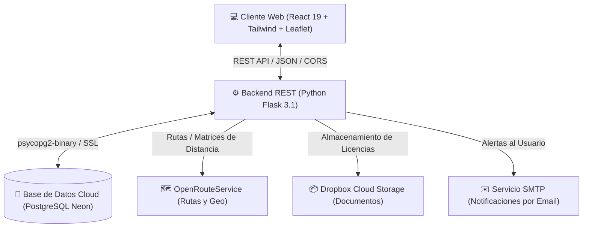

# 🚚 QUIVE — Plataforma Inteligente de Logística y Mudanzas

<div align="center">


**QUIVE** conecta a usuarios que necesitan realizar mudanzas o transporte de carga liviana con transportistas verificados, calculando rutas óptimas, asignación inteligente basada en algoritmos de puntuación, rastreo satelital en tiempo real y pasarelas de pago integradas.

</div>

---

## 📋 Tabla de Contenidos
1. [Características Principales](#-características-principales)
2. [Arquitectura del Sistema](#-arquitectura-del-sistema)
3. [Estructura del Proyecto](#-estructura-del-proyecto)
4. [Requisitos Previos](#-requisitos-previos)
5. [Instalación y Configuración](#-instalación-y-configuración)
   - [Backend (Flask + PostgreSQL Neon)](#1-backend-flask--postgresql-neon)
   - [Frontend (React SPA)](#2-frontend-react-spa)
6. [Módulos de la API REST](#-módulos-de-la-api-rest)
7. [Base de Datos y Modelo de Datos](#-base-de-datos-y-modelo-de-datos)
8. [Cuentas de Demostración](#-cuentas-de-demostración)
9. [Seguridad y Buenas Prácticas](#-seguridad-y-buenas-prácticas)

---

## 🌟 Características Principales

* 📍 **Cálculo de Rutas y Distancias Precisas**: Integración con **OpenRouteService (ORS)** y **Nominatim/OSRM** para el cálculo exacto de distancias y tiempo estimado entre origen, destino y la ubicación del transportista.
* 🧠 **Algoritmo de Matching y Ranking**: Selección automatizada y ponderada de los mejores transportistas según distancia, tipo de vehículo y reputación histórica.
* 🗺️ **Seguimiento GPS en Tiempo Real**: Visualización interactiva mediante **Leaflet**, mostrando la trayectoria del vehículo desde el punto de partida hasta la entrega.
* 💳 **Pasarela de Pagos Multimétodo**: Soporte y simulación de transacciones seguras con **Tarjeta de Crédito/Débito**, **Yape** y **PayPal**.
* 📁 **Gestión Documental en la Nube**: Carga y verificación de licencias y tarjetas de propiedad almacenadas mediante la API de **Dropbox**.
* 🔔 **Notificaciones y Auditoría**: Notificaciones en tiempo real para cambios de estado de mudanza, pagos e incidentes.
* 🛡️ **Seguridad Robusta**: Hashing criptográfico con **Bcrypt**, consultas 100% parametrizadas para prevención de inyección SQL y control estricto de CORS.

---

## 🏛️ Arquitectura del Sistema



---

## 📂 Estructura del Proyecto

```text
QUIVE/
├── apis/                             # Backend en Flask
│   ├── api/                          # Módulos organizados por Blueprint
│   │   ├── asignaciones/             # Asignación y aceptación de servicios
│   │   ├── auth/                     # Autenticación (Email/Password, Google OAuth)
│   │   ├── calificaciones/           # Sistema de reviews y reputación
│   │   ├── incidentes/               # Reporte y gestión de incidencias
│   │   ├── metodosPago/              # Métodos de pago vinculados al usuario
│   │   ├── notificaciones/           # Sistema de alertas y notificaciones
│   │   ├── objetos/                  # Inventario de enseres y objetos a trasladar
│   │   ├── pagos/                    # Transacciones y verificación de fondos
│   │   ├── solicitudes/              # Gestión de cotizaciones y solicitudes de mudanza
│   │   ├── tracking/                 # Telemetría y seguimiento satelital de la carga
│   │   ├── transportistas/           # Documentación, tarifas y verificación
│   │   └── vehiculos/                # Flota vehicular y especificaciones técnicas
│   ├── utils/                        # Módulos transversales y servicios externos
│   │   ├── calcular_distancia.py     # Integración con OpenRouteService
│   │   ├── enviar_email.py           # Servicio de envío de correo SMTP
│   │   ├── geo.py                    # Funciones geográficas y cálculo de polilíneas
│   │   ├── quickstart.py             # Integración con Dropbox API v2
│   │   ├── security.py               # Hashing y validación de contraseñas (Bcrypt)
│   │   └── verificar_metodo.py       # Simulación y procesamiento de pagos
│   ├── config.py                     # Configuración centralizada mediante variables de entorno
│   ├── db.py                         # Conexión por contexto a PostgreSQL (Neon)
│   ├── main.py                       # Fábrica de aplicación Flask (create_app)
│   ├── requirements.txt              # Dependencias de Python
│   ├── schema.sql                    # Definición de tablas, constraints y funciones PL/pgSQL
│   └── seed.sql                      # Datos iniciales y catálogo de pruebas
│
└── frontend/quive-web/               # Frontend Single Page Application (React)
    ├── public/                       # Archivos estáticos y favicon
    ├── src/
    │   ├── components/               # Componentes reutilizables (Layouts, BottomNav, Header)
    │   ├── pages/                    # Vistas principales (Landing, Login, Registro, Dashboard)
    │   │   ├── DashboardScreen/      # Paneles para Cliente y Transportista
    │   │   └── MudanzaFlow/          # Wizard paso a paso para crear una mudanza
    │   ├── api.js                    # Cliente HTTP configurado con variables de entorno
    │   ├── index.js                  # Entrada principal con proveedores de contexto
    │   └── index.css                 # Estilos globales y utilidades personalizadas
    └── package.json                  # Dependencias y scripts de frontend
```

---

## ⚙️ Requisitos Previos

* **Python** 3.10 o superior
* **Node.js** 18 o superior & **npm**
* Acceso a base de datos **PostgreSQL** (local o en la nube mediante [Neon](https://neon.tech))
* (Opcional) Token de **OpenRouteService** para cálculo de rutas en vivo

---

## 🚀 Instalación y Configuración

### 1. Backend (Flask + PostgreSQL Neon)

1. Ingresa al directorio del backend:
   ```bash
   cd apis
   ```

2. Crea y activa un entorno virtual (recomendado):
   ```bash
   python -m venv venv
   # En Windows:
   venv\Scripts\activate
   # En Linux/Mac:
   source venv/bin/activate
   ```

3. Instala las dependencias:
   ```bash
   pip install -r requirements.txt
   ```

4. Configura el archivo de variables de entorno `.env` en la carpeta `apis/` basándote en `.env.example`:
   ```env
   DATABASE_URL=postgresql://neondb_owner:<TU_PASSWORD>@<TU_HOST>/neondb?sslmode=require
   SECRET_KEY=clave_secreta_super_segura_quive_2026
   FRONTEND_URL=http://localhost:3000
   PORT=5000
   FLASK_DEBUG=true

   # Opcionales (Servicios Externos):
   ORS_API_KEY=tu_api_key_de_openrouteservice
   SMTP_USER=tu_correo@gmail.com
   SMTP_PASSWORD=tu_contraseña_de_aplicacion
   ```

5. Inicializa la base de datos (si no se ha ejecutado aún en tu instancia):
   ```bash
   # Las tablas y funciones están en schema.sql y seed.sql
   python -c "from db import get_db; conn = get_db(); print('Conexión exitosa a PostgreSQL Neon!')"
   ```

6. Inicia el servidor Flask:
   ```bash
   python main.py
   # Servidor disponible en http://localhost:5000
   # Endpoint de salud: http://localhost:5000/health
   ```

---

### 2. Frontend (React SPA)

1. Abre otra terminal e ingresa a la carpeta del frontend:
   ```bash
   cd frontend/quive-web
   ```

2. Instala las dependencias:
   ```bash
   npm install --legacy-peer-deps
   ```

3. Crea el archivo `.env` en `frontend/quive-web/`:
   ```env
   REACT_APP_API_URL=http://localhost:5000
   ```

4. Inicia el servidor de desarrollo:
   ```bash
   npm start
   # Aplicación disponible en http://localhost:3000
   ```

---

## 📡 Módulos de la API REST

El backend cuenta con **62 endpoints REST** distribuidos en los siguientes Blueprints:

| Módulo | Prefijo URL | Descripción |
|---|---|---|
| **Auth** | `/auth` | Registro de clientes/transportistas, login con hash bcrypt, Google OAuth y cierre de sesión. |
| **Solicitudes** | `/solicitudes` | Creación de solicitudes de mudanza, cotizaciones, cálculo de ruta y consulta de disponibles. |
| **Asignaciones** | `/asignaciones` | Asignación de solicitudes a transportistas, confirmación de servicios y estado. |
| **Tracking** | `/tracking` | Registro y consulta de telemetría GPS para seguimiento en vivo. |
| **Vehículos** | `/vehiculos` | CRUD de vehículos de la flota, validación de placas y catálogo de capacidades. |
| **Objetos** | `/objetos` | Catálogo de enseres (muebles, electrodomésticos) y objetos vinculados a una mudanza. |
| **Pagos** | `/pagos` | Creación, actualización y liquidación de pagos de servicios. |
| **Métodos de Pago**| `/metodos_pago` | Tarjetas, cuentas Yape y PayPal asociadas al usuario. |
| **Calificaciones** | `/calificaciones` | Reviews y cálculo de reputación de transportistas y clientes. |
| **Incidentes** | `/incidentes` | Reporte y resolución de incidencias durante el trayecto. |
| **Notificaciones** | `/notificaciones` | Registro y lectura de alertas generadas por eventos del sistema. |
| **Transportistas** | `/transportistas` | Registro de tarifas por km/volumen, ranking y subida de documentación. |

---

## 🗄️ Base de Datos y Modelo de Datos

La base de datos cuenta con **19 tablas relacionales** optimizadas para PostgreSQL:

* **Usuarios**: Clientes, transportistas y administradores con control de estado de cuenta.
* **Tipos_Vehiculo & Vehiculos**: Especificaciones de largo, ancho, alto, volumen y peso máximo.
* **Documentos_Transportista & Tarifas_Transportista**: Validación de antecedentes y tarifas por servicio.
* **Solicitudes & DistanciasSolicitud**: Almacenamiento de puntos geográficos (latitud/longitud), rutas codificadas y distancias precalculadas.
* **Objetos_Solicitud & Tipos_Objeto**: Desglose volumétrico de la carga del cliente.
* **Asignaciones & Seguimiento**: Registro temporal de coordenadas GPS del vehículo en ruta.
* **Metodos_Pago_Usuario, Pagos & Pasarelas**: Integración con `tarjeta`, `yape` y `paypal`.
* **Calificaciones, Incidentes & Notificaciones**: Retroalimentación y auditoría de eventos.

---

## 👥 Cuentas de Demostración

Las cuentas demo son las únicas que pueden tener datos de prueba. Se identifican con la columna
`Usuarios.es_demo` (migración `apis/migrations/001_cuentas_demo.sql`): la interfaz las rotula como
**CUENTA DEMO** y el backend las aísla de los usuarios reales (un cliente real nunca recibe como
candidato a un transportista demo, ni al revés). En una base ya creada aplica la migración una vez:

```bash
psql "$DATABASE_URL" -f apis/migrations/001_cuentas_demo.sql
```

El acceso rápido de la pantalla de login usa una cuenta por rol: `carlos@demo.com` (cliente) y
`juan@demo.com` (transportista).

La base de datos incluye los siguientes usuarios de prueba listos para usar (contraseña general: `password123`):

| Tipo de Usuario | Nombre | Correo Electrónico | Contraseña |
|---|---|---|---|
| **Cliente** | Carlos García | `carlos@demo.com` | `password123` |
| **Cliente** | María Rodríguez | `maria@demo.com` | `password123` |
| **Transportista** | Juan Torres | `juan@demo.com` | `password123` |
| **Transportista** | Pedro Sánchez | `pedro@demo.com` | `password123` |
| **Administrador** | Admin QUIVE | `admin@demo.com` | `password123` |

---

## 🛡️ Seguridad y Buenas Prácticas

0. **Autenticación y control por rol**: login, registro y Google devuelven un `token` firmado que el frontend envía como `Authorization: Bearer`. Cada endpoint declara qué rol puede usarlo con `@requiere_auth("cliente" | "transportista" | "admin")` (`apis/utils/auth.py`); el rol se lee de la base de datos en cada petición —nunca de la URL ni del body— y los recursos (solicitudes, asignaciones, métodos de pago, notificaciones…) validan además que pertenezcan al usuario de la sesión. Define `FLASK_SECRET_KEY` en producción: con la clave por defecto los tokens serían falsificables.
1. **Sin secretos en el código fuente**: Todas las credenciales críticas (base de datos, claves de sesión, tokens de APIs) residen exclusivamente en archivos `.env` ignorados por git.
2. **Consultas SQL Parametrizadas**: Toda interacción con la base de datos se realiza con placeholders `%s` a través del driver `psycopg2`, eliminando riesgos de inyección SQL.
3. **Criptografía Robusta**: Almacenamiento de contraseñas mediante **Bcrypt** con salt dinámico.
4. **Arquitectura Modular**: Separación limpia entre rutas (`routes.py`), lógica de negocio (`services.py`), validación de esquemas (`schemas.py`) y utilidades reutilizables (`utils/`).
5. **CORS Controlado**: Configurado para aceptar únicamente orígenes confiables tanto en desarrollo como en producción.

---

<div align="center">
Desarrollado con dedicación para modernizar la logística de mudanzas. 📦✨
</div>
